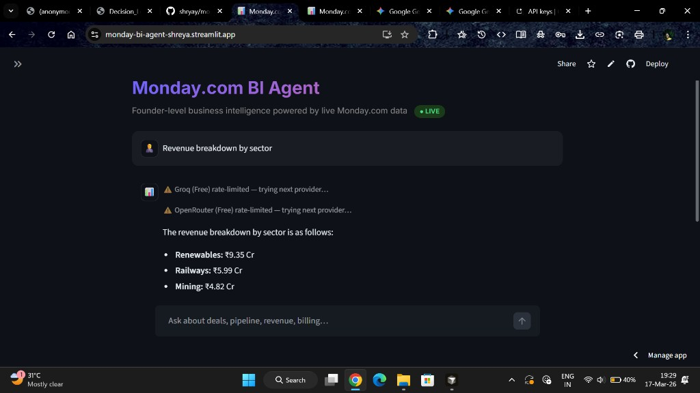
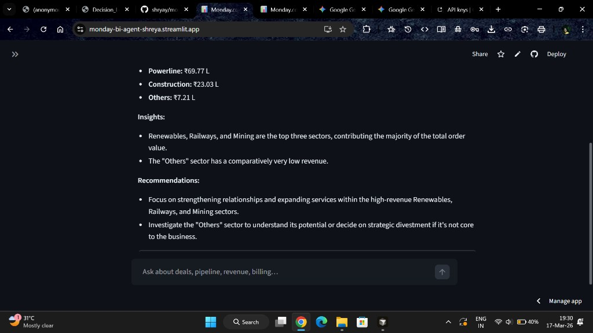
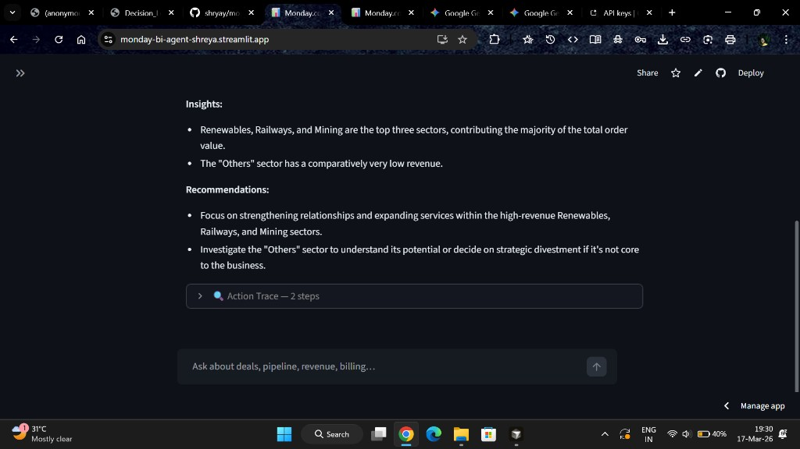

# Monday.com BI Agent

An AI-powered Business Intelligence agent that answers founder-level queries by making **live API calls** to Monday.com, cleaning messy real-world data on the fly, and delivering actionable insights through a conversational interface.

Built for the Skylark Drones AI Engineer technical assessment.

---

## Screenshots

### Revenue Breakdown by Sector


### Insights & Recommendations


### Action Trace Visibility


---

## Live Demo

**Hosted Prototype:** [monday-bi-agent-shreya.streamlit.app](https://monday-bi-agent-shreya.streamlit.app/)

**Monday.com Boards:**
- [Deals Pipeline](https://connectshreyaupadhyays-team.monday.com/boards/5027263770)
- [Work Orders](https://connectshreyaupadhyays-team.monday.com/boards/5027263778)

---

## Architecture

```
                          ┌─────────────────────┐
                          │   Streamlit Chat UI  │
                          │   (app.py)           │
                          └──────────┬───────────┘
                                     │ user question
                                     ▼
                          ┌─────────────────────┐
                          │   AI Agent           │
                          │   (agent.py)         │
                          │                      │
                          │   LLM decides which  │
                          │   tools to invoke    │
                          └──┬──────────┬────────┘
                             │          │
              tool call 1    │          │   tool call 2
                             ▼          ▼
               ┌──────────────┐  ┌──────────────┐
               │  Deals Board │  │  Work Orders │
               │  (GraphQL)   │  │  (GraphQL)   │
               └──────┬───────┘  └──────┬───────┘
                      │                 │
                      ▼                 ▼
               ┌────────────────────────────────┐
               │   Data Processor                │
               │   (data_processor.py)           │
               │                                 │
               │   • Clean nulls & bad formats   │
               │   • Normalize dates & numbers   │
               │   • Filter by sector/status     │
               │   • Generate summary statistics │
               │   • Report data quality issues  │
               └────────────────┬────────────────┘
                                │ structured summary
                                ▼
               ┌────────────────────────────────┐
               │   LLM generates insight         │
               │   with risks, opportunities,    │
               │   and recommendations           │
               └────────────────────────────────┘
```

**Flow:**
1. User asks a natural language question (e.g., *"How's our pipeline for Mining?"*)
2. The LLM interprets the question and decides which Monday.com boards to query
3. Live GraphQL API calls fetch the latest data (per-request caching avoids redundant calls)
4. Data processor cleans inconsistencies — nulls, duplicate headers, format mismatches
5. Cleaned data is summarized into compact statistics
6. LLM generates a conversational insight with risks, opportunities, and recommendations
7. Every API call and processing step is logged in a visible **Action Trace**

---

## Key Features

### 1. Live Monday.com Integration
- Every query triggers fresh GraphQL API calls — no stale data
- Per-request board caching avoids redundant API calls when multiple tools query the same board
- Cursor-based pagination handles boards of any size
- Connection validation on startup

### 2. AI-Powered Tool Calling
- LLM autonomously decides which boards to query based on the question
- Three tools available: `query_deals_board`, `query_work_orders_board`, `cross_board_analysis`
- Supports multi-tool orchestration (e.g., querying both boards for a sector comparison)
- Automatic recovery from malformed tool calls (Groq/Llama compatibility)

### 3. Automatic Provider Fallback
- Supports 4 LLM providers: **Groq**, **OpenRouter**, **Google Gemini**, **OpenAI**
- If the primary provider is rate-limited or unavailable, automatically tries the next one
- Shows fallback status in real-time (e.g., "Groq rate-limited — trying next provider…")
- Graceful "all providers exhausted" message when every provider fails

### 4. Messy Data Resilience
- Handles missing/null values across all columns
- Normalizes inconsistent date formats (ISO, DD/MM/YYYY, etc.)
- Filters out duplicate header rows embedded in the data
- Parses monetary values from varied string formats
- Fuzzy column-name matching (tolerates minor naming differences from Monday.com)
- Reports data quality scores and caveats in every response

### 5. Founder-Level Insights
- Provides analysis across revenue, pipeline health, sector performance, and billing
- Highlights **risks**, **opportunities**, and **recommendations** — not just raw numbers
- Formats monetary values in Indian notation (₹ Cr / ₹ L)
- Cross-board analysis connects deal pipeline to work order execution

### 6. Token-Efficient Design
- Tool output truncation (6K char cap) keeps LLM calls lean
- Compact system prompt (~120 tokens vs typical ~350)
- Conversation history limited to last 4 exchanges to reduce context size
- Graceful rate-limit handling with user-friendly messages and provider-switching guidance

### 7. Conversational Interface
- Natural language query understanding
- Follow-up question support with conversation memory
- Clickable starter questions for quick exploration
- Clarifying questions when the query is ambiguous

### 8. Action Trace Visibility
- Expandable trace panel on every response
- Shows: which tools the AI called, API response times, rows fetched, filters applied
- Full transparency into the agent's decision-making process

---

## Tech Stack

| Layer | Technology | Rationale |
|-------|-----------|-----------|
| **UI** | Streamlit | Fastest path to a production chat interface with zero frontend code |
| **AI Engine (primary)** | Google Gemini 2.5 Flash | Free tier, excellent tool-calling, high rate limits |
| **AI Engine (fallback)** | Groq (Llama 3.3 70B) / OpenRouter / OpenAI | Auto-fallback chain across 4 providers for maximum uptime |
| **Data Source** | Monday.com GraphQL API | Live integration as required; cursor-based pagination |
| **Data Processing** | pandas | Industry standard for tabular data cleaning and aggregation |
| **Deployment** | Streamlit Cloud | Free hosting with secrets management, one-click deploy |

---

## Project Structure

```
monday_bi_agent/
├── app.py                 # Streamlit application — chat UI, config, starter questions
├── agent.py               # AI agent — LLM orchestration, tool definitions, recovery logic
├── monday_client.py       # Monday.com GraphQL client — queries, pagination, action logging
├── data_processor.py      # Data cleaning — normalization, analytics, quality reporting
├── requirements.txt       # Python dependencies
├── .env.example           # Environment variable template (no secrets)
├── .gitignore             # Keeps .env and caches out of version control
├── .streamlit/
│   └── config.toml        # Streamlit theme and server config
├── screenshots/           # App screenshots for documentation
├── Decision_Log.md        # Architecture and trade-off decisions
├── Decision_Log.pdf       # PDF version of decision log
└── README.md              # This file
```

---

## Setup

### Prerequisites
- Python 3.10+
- A [Monday.com](https://monday.com) account with imported data boards
- An API key from one of: [Groq](https://console.groq.com) (free) / [Google AI Studio](https://aistudio.google.com/apikey) (free) / [OpenAI](https://platform.openai.com) (paid)

### 1. Clone and Install

```bash
git clone https://github.com/shryay/monday-bi-agent.git
cd monday-bi-agent
pip install -r requirements.txt
```

### 2. Configure Environment

Copy the example file and fill in your keys:

```bash
cp .env.example .env
```

Edit `.env`:
```
MONDAY_API_TOKEN=your_monday_token
GROQ_API_KEY=your_groq_key
DEALS_BOARD_ID=5027263770
WORK_ORDERS_BOARD_ID=5027263778
```

### 3. Run Locally

```bash
streamlit run app.py
```

Opens at `http://localhost:8501`. API keys load automatically from `.env`.

### 4. Deploy to Streamlit Cloud

1. Push to GitHub
2. Go to [share.streamlit.io](https://share.streamlit.io) → **New app** → select repo → `app.py`
3. Add secrets in **Settings → Secrets** (TOML format):
   ```toml
   MONDAY_API_TOKEN = "your_token"
   GROQ_API_KEY = "your_key"
   DEALS_BOARD_ID = "5027263770"
   WORK_ORDERS_BOARD_ID = "5027263778"
   ```
4. Deploy — live URL is ready instantly

---

## Monday.com Board Setup

### Importing the Data

1. Convert `.xlsx` files to CSV (File → Save As → CSV)
2. In Monday.com: **+ Add** → **Import data** → **Excel/CSV** → upload each file
3. Configure column types after import:
   - Date columns → **Date** type
   - Monetary columns → **Numbers** type
   - Status columns → **Status** type

### Data Characteristics

| Board | Rows | Key Columns | Known Issues |
|-------|------|-------------|-------------|
| **Deals Pipeline** | 346 | Deal Status, Deal Stage, Sector, Deal Value, Probability | 52% missing deal values, 75% missing probability, 2 duplicate header rows |
| **Work Orders** | 176 | Execution Status, Sector, Amount, Billed, Collected, Receivable | 56% missing collected amounts, 84% missing billing status |

The agent handles all these issues automatically and reports data quality caveats in responses.

---

## Example Queries

| Query | What Happens |
|-------|-------------|
| *"How's our pipeline for Mining?"* | Fetches deals board → filters Mining → shows pipeline value, win rate, stage breakdown |
| *"Revenue breakdown by sector"* | Fetches work orders → aggregates by sector → shows order value, billed, collected |
| *"Compare pipeline vs actual revenue"* | Cross-board analysis → compares deal pipeline to work order revenue |
| *"What's the win rate for Renewables?"* | Fetches deals → filters Renewables → calculates won/dead ratio |
| *"Which deals are on hold?"* | Fetches deals → filters On Hold status → shows deal names and values |
| *"Show collection status"* | Fetches work orders → billing and collection metrics |

---

## Design Decisions

1. **Live API calls with per-request caching** — Every new question triggers fresh Monday.com API calls, ensuring current data. Within a single query, board data is cached so multi-tool calls don't re-fetch.

2. **LLM tool-calling over prompt stuffing** — Instead of dumping raw data into the prompt, the agent uses structured function calls. This keeps token usage low and makes the system extensible.

3. **Token-efficient pipeline** — Compact system prompt (~120 tokens), tool output truncation (6K char cap), and limited conversation history (~4 messages) reduce per-query token usage by ~60%, maximizing queries within free-tier limits.

4. **Summary-first architecture** — Raw board data is cleaned and summarized into statistics before reaching the LLM. This produces more focused insights and avoids token limits.

5. **Automatic provider fallback** — The app tries up to 4 LLM providers (Groq → OpenRouter → Gemini → OpenAI) in sequence. If one is rate-limited or unavailable (429/503), it automatically falls through to the next, maximizing uptime on free tiers.

6. **Automatic tool-call recovery** — Llama models occasionally generate malformed tool calls. The agent catches these, parses the intended function from the error, executes it, and continues seamlessly.

7. **Keyword-based column matching** — Monday.com column titles may differ from original Excel headers. The processor uses fuzzy keyword matching to map columns reliably.

---

## Troubleshooting

| Issue | Solution |
|-------|---------|
| "Authentication failed" | Regenerate Monday.com API token |
| "Board not found" | Check board ID from the URL |
| Empty results | Verify data was imported correctly |
| Slow responses | Switch to a faster model in the sidebar |
| Rate limit errors | Switch provider in sidebar, or wait for limit reset |
| Tool call failures | The agent auto-recovers; if persistent, try rephrasing |
